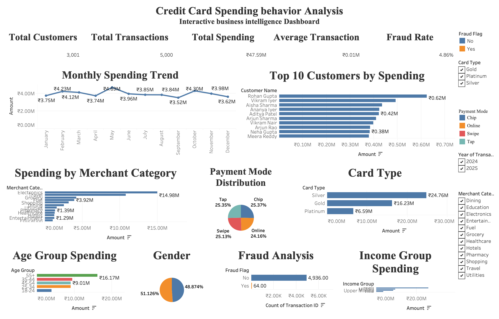

# 💳 Credit Card Spending Behavior Analysis Dashboard


---

## 📌 Project Overview

This project analyzes **3000+ credit card transactions** to understand customer spending behavior, transaction patterns, fraud activities, and revenue drivers across different cities, merchant categories, payment methods, and card segments.

The objective was to transform raw transaction data into actionable business insights that help banks improve:

- Customer engagement strategies
- Card usage optimization
- Fraud monitoring
- Marketing campaigns
- Revenue growth opportunities

---

## 🎯 Business Questions
The analysis focuses on answering key business questions:
- which customer contribute the most spending?
- Which merchant categories contribute the most spending?
- How do customers prefer to make payments? 
- Which card types are the most profitable?
- What is the current fraud rate?
- Which business strategies can improve customer retention and profitability?

---

## 🎯 Business objectives

Banks require actionable insights from transaction data to answer critical business questions such as:

- Analyze customer spending behavior.
- Identify high-value customer segments.
- Analyzed monthly spending trend.
- Evaluate card-wise and  payment mode distribution.
- Measure fraud occurrence.
- Develop an executive dashboard for decision-makers.
- Generate business recommendations to improve revenue and customer engagement.

## 🛠️ Tools & Technologies

| Category        | Technologies                     |
| --------------- | -------------------------------- |
| Data Cleaning   | Microsoft Excel, Python (Pandas) |
| Data Analysis   | Python, SQL                      |
| Database        | MySQL                            |
| Visualization   | Tableau                          |
| Programming     | Python                           |
| Version Control | Git & GitHub                     |
| IDE             | VS Code                          |


---

## 📊 Dataset Information

| Metric                    |          Value |
| ------------------------- | -------------: |
| Total Customers           |          3,001 |
| Total Transactions        |          5,000 |
| Total Spending            | ₹47.59 Million |
| Average Transaction Value |         ₹9,518 |
| Fraud Rate                |          4.86% |

---

## 📊 Data Analysis Workflow

The project follows an end-to-end analytics workflow:

### 1. Data Cleaning

- Handled missing values
- Removed duplicate transactions
- Standardized categorical fields
- Converted date columns into analysis-ready formats

### 2. Exploratory Data Analysis

Performed analysis on:

- Customer spending patterns
- Transaction trends
- City-wise contribution
- Merchant category performance
- Payment preferences
- Fraud detection patterns

### 3. Dashboard Development

Built an interactive dashboard to provide business users with quick insights.

---

## 📊 Dashboard Features

- Executive KPI Cards
- Monthly Spending Trend Analysis
- Top 10 customers
- Merchant Category Performance
- Card Type Analysis
- Payment Mode Analysis
- Age Group Analysis
- income Group spending
- Fraud Detection Dashboard
- Interactive Filters

---

## 🖼️ Dashboard Preview



---

## 💡 Key Business Insights

- 👥 Total spending reached ₹47.59M across 5,000 transactions from 3,001 customers, indicating strong customer engagement.
  
- 📈 Monthly spending remained stable throughout the year, with the highest spending recorded in May (₹4.69M) and the lowest in September (₹3.52M).
  
- 🛒 Electronics is the top-performing merchant category, contributing nearly ₹15M, making it the primary revenue driver.
  
- 💳 Silver cardholders generated the highest spending (₹24.76M), followed by Gold cardholders, while Platinum cardholders contributed the least.
  
- 👥 Customers aged 35–44 represent the highest-spending demographic, making them the most valuable customer segment.
  
- 📱 Payment activity is evenly distributed across Chip, Swipe, Online, and Tap modes, reflecting diverse customer payment preferences.
  
- 🚨 Fraud detection identified only 64 suspicious transactions out of 5,000, indicating a low fraud occurrence while highlighting the effectiveness of transaction monitoring systems.


---

## 🚀 Business Recommendations

Based on the analysis:

- Launch premium card promotions in high-spending cities.
- Provide cashback and EMI benefits for frequently used merchant categories.
- Develop personalized offers based on customer spending behavior.
- Increase digital payment adoption through contactless payment rewards.
- Strengthen fraud prevention using AI-based monitoring for suspicious transaction patterns.

---

# 📚 Skills Demonstrated

* Data Cleaning
* Data Wrangling
* Exploratory Data Analysis (EDA)
* SQL Query Writing
* Database Design
* Tableau Dashboard Development
* KPI Reporting
* Business Intelligence
* Data Visualization
* Business Storytelling
* Banking Domain Analytics
* Git & GitHub Version Control

---

# 🚀 How to Run

### Clone the repository

```bash
git clone https://github.com/saisahithipalacharla27/Credit-Card-Spending-Behavior-Analysis.git
```

---

## 📂 Repository Structure
```text
Credit-Card-Spending-Analysis/
│
├── data/
│   └── credit_card_transactions.csv
│
├── notebooks/
│   └── analysis.ipynb
│
├── sql/
│   └── analysis_queries.sql
│
├── dashboard/
│   └── Credit_Card_Dashboard.pbix
│
├── images/
│   └── dashboard.png
│
├── report/
│   └── Credit_Card_Analysis_Report.pdf
│
└── README.md
```
---

# 🔮 Future Enhancements

* Build a real-time dashboard using live transaction data.
* Develop a machine learning model for fraud prediction.
* Create a Streamlit web application for interactive analytics.
* Automate monthly business reporting.
* Perform customer segmentation using clustering techniques.

---

## 📄 Project Report

A detailed Business Intelligence Report explaining the methodology, dashboard interpretation, business insights, and recommendations is available in the **reports/** folder.


## 👩‍💻 Author

**Sai Sahithi Palacharla**

Aspiring Data Analyst

🔗 GitHub: https://github.com/saisahithipalacharla27

💼 LinkedIn: https://www.linkedin.com/in/sahithipalacharla/ 


